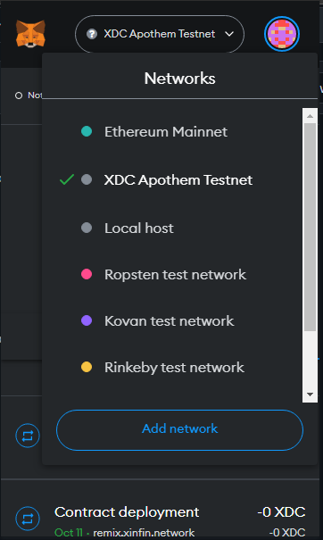
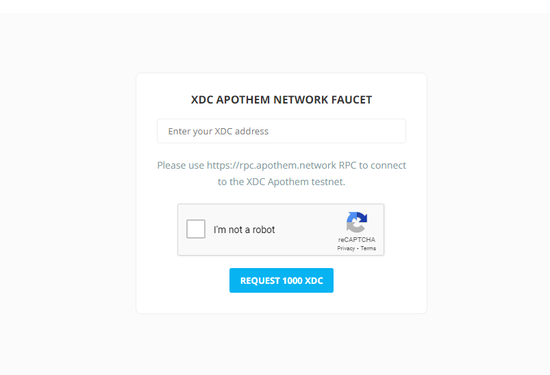
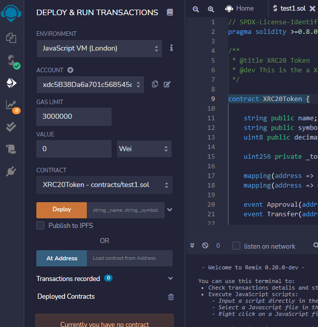
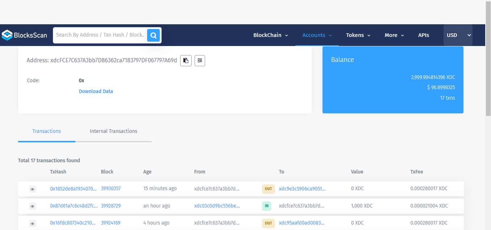

# How-To-Verify-A-Smart-Contract-On-The-XDC-Network

In this tutorial u gonna learn how to deploy and verify ur smart contract on XDC network

## What u gonna learn?
* How to setup XDC apothem test network in ur meta mask wallet
* How to use [Xinfin network Remix](https://remix.xinfin.network/) to deploy ur smart contract on XDC network
* How to connect ur meta mask with it
* How to verify ur smart contract on XDC network

## Here is the vedio tutorial of mine on how to deploy and verify ur smart contract on XDC network
[here is the link to the tutorial](https://youtu.be/47mQ83fYUoA)

## Here is the tutorial in written format

### - Adding XDC Apotheum Network to our metamask wallet

Open ur meta mask wallet


then click on account icon above in the upper right corner


then click on settings 


then click on  network


then click on add network 


then to add the XDC apothem network add this details in the form and click save

-Network name-XDC Apothem Testnet

-New RPC URL-https://apothemxdcpayrpc.blocksscan.io/

-Chain ID-51

-Currency symbol-XDC

-Block explorer URL(Optional)-https://explorer.apothem.network

then click on the networks and select the XDC Apothem network



### - Adding test XDC to our XDC apothem network

So what u have to do here is to go to the site called [faucet.apothem.network](https://faucet.apothem.network/)



put ur XDC Apothem address there put make sure to remove the "0x" from the front of the address and write "xdc" rather


fill the recaptcha and click on request 1000 XDC u will see something like this means transaction of test XDC to ur account is successfuly done 


Now we are ready to deploy our smart contract

### - Deploying and verifying the smart contract on XDC network 

first what we gonna do is to visit [remix.xinfin.network](https://remix.xinfin.network/) u will see something like this


Now what u have to do is to click on create new file


then name it anything but make sure to put ".sol" in the last for example here i made a file called "test1.sol"


Now u have to write ur smart contract in that file im gonna use this smart contract in this tutorial its a smart contract to make XCR20token

```
// SPDX-License-Identifier: MIT
pragma solidity >=0.8.0 <0.9.0;

/**
 * @title XRC20 Token
 * @dev This is the a XinFin Network Compatible XRC20 token.
 */

contract XRC20Token {

    string public name;
    string public symbol;
    uint8 public decimals;

    uint256 private _totalSupply;
    
    mapping(address => uint) private balances;
    mapping(address => mapping(address => uint)) private allowances;
    
    event Approval(address indexed owner, address indexed spender, uint value);
    event Transfer(address indexed from, address indexed to, uint value);
      
    constructor(string memory _name, string memory _symbol, uint8 _decimals, uint256 _initialSupply) {
        name = _name;
        symbol = _symbol;
        decimals = _decimals;

        _totalSupply += _initialSupply * 10 ** decimals;
        balances[msg.sender] = _totalSupply;
        emit Transfer(address(0), msg.sender, _totalSupply);
    }

    function totalSupply() public view virtual returns (uint256) {
        return _totalSupply;
    }

    function balanceOf(address account) public view virtual returns (uint256) {
        return balances[account];
    }

    function allowance(address owner, address spender) public view virtual returns (uint256) {
        return allowances[owner][spender];
    }

    function transfer(address recipient, uint amount) external returns (bool) {
        balances[msg.sender] -= amount;
        balances[recipient] += amount;
        emit Transfer(msg.sender, recipient, amount);
        return true;
    }

    function approve(address spender, uint amount) external returns (bool) {
        allowances[msg.sender][spender] = amount;
        emit Approval(msg.sender, spender, amount);
        return true;
    }

    function transferFrom(
        address sender,
        address recipient,
        uint amount
    ) external returns (bool) {
        allowances[sender][msg.sender] -= amount;
        balances[sender] -= amount;
        balances[recipient] += amount;
        emit Transfer(sender, recipient, amount);
        return true;
    }

}
```


now what we have to do is to compile our code to do go to this we have to click on the nav element called solidity compiler on the left side of the screen 


now u will see something like this 


now what u have to do is to click on compile "ur file name " in my case the file name is test1.sol so it is complie test1.sol
if no error occurs u will see this green tick it means ur smart contract is succesfully compiled


now we can deploy it on the XDC network to do it go to the deploy and run transactions nav element just below the compiler 


u gonna see something like this



u don't have to do anything with the other parts other than environment . Environment means where the smart contract gonna be deployed 
at the moment u will see it comes default as Javascript VM (london) but we wanna deploy our contract on XDC apothem network so add that we gonna click on environment it gonna open a list of environment u have to choose injected web3 what this gonna do is connect to ur metamask and gonna detect apothem network and make it as default to deploy our smart contract on 
metamask window will pop up to connect to the remix.xinfin.network u click connect and it will connect the metamask easily


before connecting make sure that ur default network is XDC apothem network


after it is connected u will be able to see ur address in accounts 


now we are ready to deploy our contract 
as my smart contract is to make a ERC20token im gonna fill this input its asking for the token name token id etc before i click deploy 
(this input needs only in some smart contracts it depends on ur smart contract its not necessary that u gonna see this may be ur contract is different so don't stress about that u can click deploy directly)


now we can deploy our smart contract to do it click on deploy metamask window will pop up asking to confirm the transaction u click confirm (make sure u have test XDC in ur wallet other wise it will give error)


in a few sec u will see this line this means ur smart contract is successfully deployed on XDC network


## -verifying the smart contract

now as we have deployed our smart contract on XDC network we can now verify it 
to verify it u have to visit the site [explorer.apothem.network](https://explorer.apothem.network/)


now copy ur meta mask XDC apothem network address(make sure to remove "0x" and write "xdc instead") and paste it in the search bar of exploror.apothem.network click enter u will see ur account details 



now in the transactions the top transaction is the smart contract we just deployed like in my case


and this is our smart contract address now u have to click on that smart contract address


u will see the smart contract details 


u can see verify and publish link is there click on it this page will come 


now to verify it we have to feel it the contract address comes fill automatically next thing is 'contract name' here u have to fill the contract name u put in ur smart contract code like in my case it is XRC20token 


now we have to fill complier its gonna be the compiler version we used to compile our smart contract u can see it by going to remix.xinfin.network in compile section u can see the compiler version like in my case is this


gonna select it in the verify contract 


now as we didn't do optimistion we gonna let it be no only 

now we have to put our solidity code of smart contract here in this input box


now after filling this all the things we can click submit
and ur smart contract is verified 


## this was the tutorial on how to deploy and verify ur smart contract on XDC network i hope u found this helpful 


## -some useful links

-https://remix.xinfin.network/

-https://explorer.apothem.network/

-https://faucet.apothem.network/

-https://docs.soliditylang.org/en/v0.8.17/

## thanks for reading
