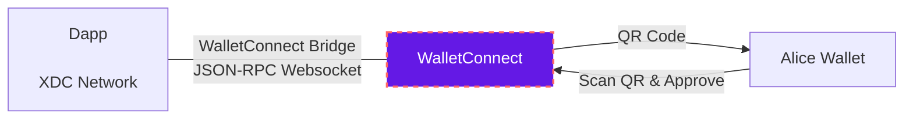

# WalletConnect

The communications protocol for web3. [WalletConnect](https://walletconnect.com/) brings the ecosystem together by enabling wallets and apps to securely connect and interact. Opening up a whole world of Dapps that were once only available to specific wallets.

---

## What is Used

What is WalletConnect and for what is used? Is an open source **protocol** to communicate securely between Wallets and Dapps (Web3 Apps) using end-to-end encryption. The user can interact with any Dapp without comprising their private keys and will be notified to sign any transaction requests on their wallet.

## Understanding WalletConnect

**How does it work**? It's based on a websocket JSON-RPC channel, WalletConnect is a simple infrastructure that can be setup by any developer. Using a Bridge server to relay the messages without having access to any of its contents.

WalletConnect is an protocol for connecting Dapps to Wallets by scanning a QR code, the protocol establishes a remote connection between two apps and/or devices using a Bridge server to relay payloads. These payloads are symmetrically encrypted through a shared key between the two peers.

The connection is initiated by one peer displaying a QR Code or deep link with a standard WalletConnect URI and is established when the counter-party approves this connection request. It also includes an optional Push server to allow Native applications to notify the user of incoming payloads for established connections.

