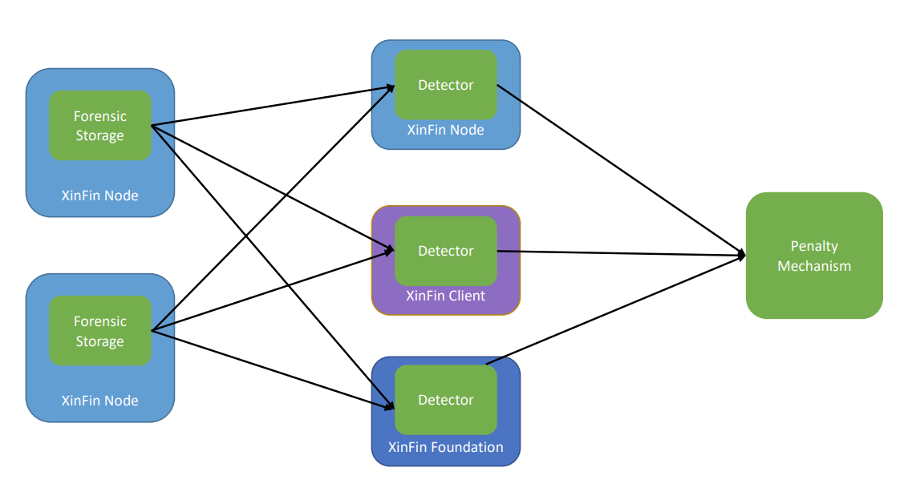
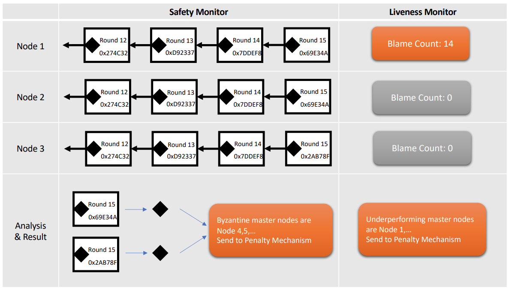

# Blockchain Forensics

In the unlikely case where the ratio of Byzantine nodes exceeds 1/3, it is possible for these nodes to collude and create a security violation — either a safety violation or a liveness violation. However, they cannot achieve this without being held accountable and punished, thanks to the protocol design.&#x20;

### Safety Violation and Forensic Monitoring

When the adversary corrupts more than 1/3 master nodes in the BFT committee of an epoch, it is possible for the adversary to violate the safety and jeopardize the consensus by creating forks - such as two finalized blockchains. However, certain messages need to be signed and sent by these nodes to make this happen, which can be detected by the system and served as irrefutable evidence of the misbehavior. Those messages are embedded into the blockchain and can be obtained by querying master nodes for forked blockchains.&#x20;

This property of XDPoS 2.0 enables our safety forensic feature, which can identify as many Byzantine master nodes as possible while obtaining the proof from querying as few witnesses as possible. The process of identifying culpable Byzantine master nodes involve performing appropriate quorum intersections: since two quorums of tH ≈ VALIDATOR\_SET\_SIZE × 2/3 master nodes intersect in at least VALIDATOR\_SET\_SIZE/3 master nodes, we are able to identify that many Byzantine master nodes, which is the optimal number we can identify. As for the witnesses, two honest nodes having access to one of the two conflicting blockchains, respectively, are sufficient for the proof. Since non-master nodes also passively monitor the blockchain, they can serve as witnesses as well. This also implies that as long as there are at least two honest nodes in the XDC network and the adversary wants to create a safety violation for the two nodes, we can provide this forensic feature.&#x20;

Once a master node is held culpable by the forensic protocol, the proof should be provided to a XinFin governance-driven penalty mechanism (e.g. a slashing smart contract).&#x20;

### Liveness Violation and Forensic Monitoring

&#x20;In XDPoS 2.0, Byzantine master nodes can also slow down the blockchain instead of creating forks. This behavior is called underperforming, and can take three forms:

1. a master node fails to propose a block when it is the leader;
2. the leader proposes a block but does not use the latest QC as _parentQC_ ;
3. a master node (non-leader) fails to propagate vote messages.&#x20;

If there are more than 1/3 underperforming master nodes, the performance of XDPoS 2.0 could be decreased and we call it a liveness violation.&#x20;

However, unlike safety violation, there is no cryptographic evidence for liveness violation to hold underperforming master nodes culpable. The handling of liveness violation is thus softer than safety violation: Master nodes should broadcast a blame message if they believe another master node is underperforming. Those messages are collected and reported to XinFin governance-driven penalty mechanism for final decision, such as excluding the suspect node from master node election for certain number of epochs or raising its deposit requirement.&#x20;

### Implementation

&#x20;We plan to implement the corresponding forensic monitoring protocol as a module on top of the HotStuff protocol. The module consists of three components and this structure is shown in Figure 4.&#x20;

• **Forensic Storage**, a database at the XinFin nodes that stores forensic information. It maintains a map from the round number to quorum certificates, blocks, and their persistent storage. In addition, it records the blame messages as well. It can be accessed by other participants of the system, including other nodes (e.g., via RPC requests).&#x20;

• **Detector**, which can be run by any participant of XinFin system. It sends requests periodically to connected nodes and use the returned information for safety and liveness forensic monitoring.&#x20;

<figure><figcaption>
4: Forensic module structure and information flow. 
</figcaption></figure>

If it finds enough information to penalize a master node, it will send the information to the penalty mechanism.&#x20;

• **Penalty Mechanism**, a XinFin governance-driven body that decides the penalty for safety and liveness violation. It implements both hard penalty (e.g. slashing Byzantine nodes’ deposits via a slashing smart contract or excluding them from master node selection) and soft penalty (e.g. raising the deposit requirement).

<figure><figcaption>
Figure 5: Detector dashboard.
</figcaption></figure>

We will build a dashboard for the detectors to visualize the forensic information. Figure 5 is an artistic impression, which displays information about each node’s blockchain, blame messages, as well as safety and liveness forensic monitoring results.
