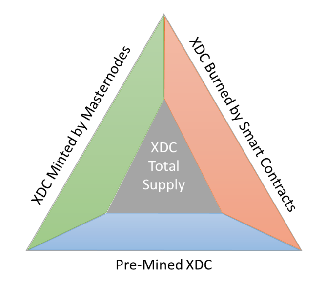
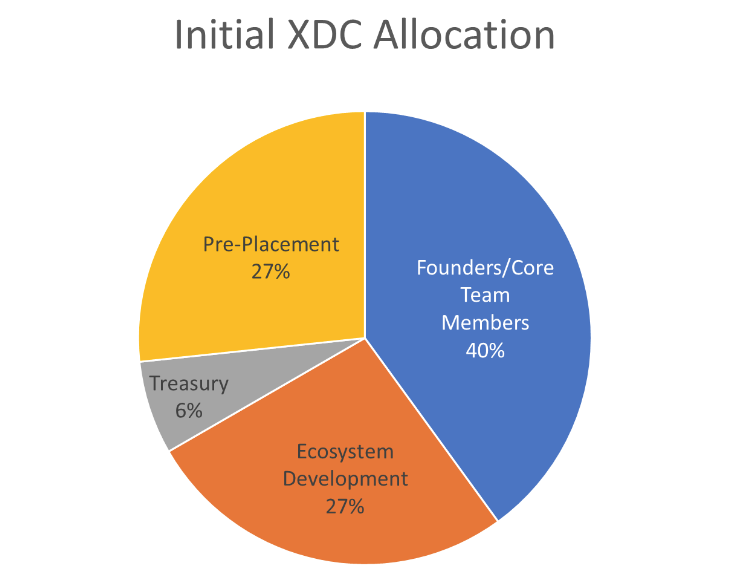

# Tokenomics

## Introduction&#x20;

This paper will discuss the tokenomics of XDC with a focus on token distribution using a snapshot of the ledger taken on September 14, 2021. All the data presented in this paper was collected using the XinFinScan APIs to interrogate the XDC Network and verified using the XDC Network Explorer.

## XDC Supply&#x20;

There are three forces at play when considering the total supply of XDC; pre-mining of XDC, minting of XDC, and burning of XDC. 37.5B XDC were pre-mined at the creation of the mainnet. Masternodes create an estimated 86.7 million XDC per year as a reward for validating transactions, which applies an inflationary pressure to the total supply of XDC. As smart contracts execute on the XDC Network a portion of the transaction fees are burned, which applies a deflationary pressure to the total supply of XDC. Eventually the number of XDC burned through smart contract execution will outpace the number of XDC minted through masternode operation, which will cause the XDC Network to become deflationary.

<figure><figcaption></figcaption></figure>

### Pre-Mined Supply

&#x20;At 6:19:19 AM UTC -4 on May 30, 2019, block 0 on the XDC Network mainnet was closed out, with XDC address xdc54d4369719bf06b194c32f8be57e2605dd5b59e5 holding all 37,469,999,999.99496 pre-mined XDC (approximately 37.5 B XDC). The total number of pre-mined XDC is not a max supply, it is simply the number of XDC in the genesis wallet at mainnet creation.&#x20;

### Minted XDC&#x20;

As of September 14, 2021, at the close of block 35,098,808 the total supply is 37,694,082,084 XDC. Each block, where blocks close with finality every 2 seconds on average, 5.5 XDC are minted as rewards for Masternode operators. The XDC Network is a Delegated Proof of Stake Consensus network that relies on a system of 108 Masternodes, each running the XDPoS consensus algorithm.&#x20;

### Masternodes&#x20;

An XDC Network masternode is a server which uses its computing power to contribute to the network. Its job is to create and sign blocks. For this contribution to the network, masternodes receive rewards in the form of XDC. However, masternode owners need to invest in XinFin Network by depositing at least 10,000,000 XDC, for the long term.&#x20;

At current prices ownership and operation of masternodes is expensive for retail investors and the majority of retail investor owned masternodes are owned early investors. Masternode rewards incentivize early XDC investors to lock up increments of 10,000,000 XDC to own and operate masternodes, which has a stabilizing effect on the price of XDC in retail markets. As of September 14, 2021, at the close of block 35,098,808 a total of 1,863,025,000 XDC have been staked in masternodes.&#x20;

### Burned XDC

As of September 14, 2021, at the close of block 35,098,808 a total of 716,356 XDC have been burned. 20% of transaction fees are burned for each transaction on the XDC Network that takes places through smart contract execution. The rate at which XDC is burned will continue to grow as network utility continues to grow through creation, deployment, and execution of smart contracts.&#x20;

### Smart Contracts&#x20;

A smart contract is computer code running on top of a blockchain containing a set of rules under which the parties to that smart contract agree to interact with each other. When the predefined rules are met, the agreement is automatically enforced. The smart contract code facilitates, verifies, and enforces the negotiation or performance of an agreement or a transaction. It is the simplest form of decentralized automation.&#x20;

In simpler words, a smart contract allows exchanges of any type of assets like money and property in a conflict-free way without the services of a middleman. Hence it facilitates a trustless execution which is an important feature that is promised by a smart contract.&#x20;

## XDC Allocation

The founders/developers of a blockchain project are bound to formulate a strategy to distribute their tokens in two ways: the initial distribution before the launch of the project and the distribution on an ongoing basis post-launch. The proper distribution of the token subtly acts as a foundation of the project’s long-term success.&#x20;

In the case of the XDC Network, the initial token distribution has been allocated as follows:

|     Classification    |     Allocation     | Percentage |
| :-------------------: | :----------------: | :--------: |
|     Founders/Team     |   15,000,000,000   |     40%    |
| Ecosystem Development |   10,000,000,000   |     27%    |
|        Treasury       |    2,500,000,000   |     6%     |
|     Pre-Placement     |   10,000,000,000   |     27%    |
|       **Total**       | **37,500,000,000** |  **100%**  |

<figure><figcaption></figcaption></figure>

### Founders, Advisors, Core Team Members, and Community&#x20;

With the release of the mainnet, 40% of the total XDC supply was allocated to the founders, community, core team, and advisors of the project. That initial allocation for this tranche was 15,000,000,000 XDC. As of September 14, 2021 this tranche exists at XDC account xdcd77875df9c9de07a5a701f4431743e3a0e9fe03a holding 14,950,000,899.9987400000 XDC.&#x20;

### Ecosystem Development&#x20;

With the release of mainnet, 26.67% of the total supply, amounting to 10,000,000,000 XDC was allocated for ecosystem development. This allocation includes the XDC allocated for bounty programs. As of September 14, 2021 this tranche exists at XDC account xdcb94249638a3cd070794a6896f65b954547685f8f holding 6,338,543,636.3247690000 XDC.&#x20;

### Treasury&#x20;

With release of mainnet 6.66% of the total supply, amounting to 2,500,000,000 XDC, was allocated for the treasury for the XDC Foundation. This allocation allows the team to curate and maintain the XDC Network by team employees and by hiring external integrators for development and support of the network. As of September 14, 2021, this tranche exists at XDC Account xdcd1cf94a058a986d25d0cef5f6109ef2419ec8b78 holding 1,116,060,855.9989500000 XDC.&#x20;

### Pre-Placement&#x20;

With release of mainnet 26.67% of the total supply, amounting to 10,000,000,000 XDC, was allocated for exchanges and early investors. This tranche is spread across multiple XDC accounts held by both exchanges and individual investors. As of September 14, 2021, this tranche holds 9,014,925,816.92 XDC

### Circulating Supply&#x20;

We can calculate the circulating supply of XDC by adding up the XDC controlled by the XDC Foundation, the XDC locked up in masternodes, and the locked pre-placement XDC and taking the difference from the current total supply. As of September 14, 2021 the circulating supply can be calculated as: Circulating Supply = Total Supply – (Team Controlled XDC + Masternode Staked XDC + Locked Pre-Placement XDC).

|       XDC Source       |                  Supply (XDC)                  |
| :--------------------: | :--------------------------------------------: |
|      Total Supply      |                 37,694,082,084                 |
|    Masternode Stake    |  <mark style="color:red;">1,863,025,000</mark> |
|  Locked Pre-Placement  |   <mark style="color:red;">559,966,582</mark>  |
|     Team Controlled    | <mark style="color:red;">22,404,605,390</mark> |
| **Circulating Supply** |               **12,866,485,112**               |

