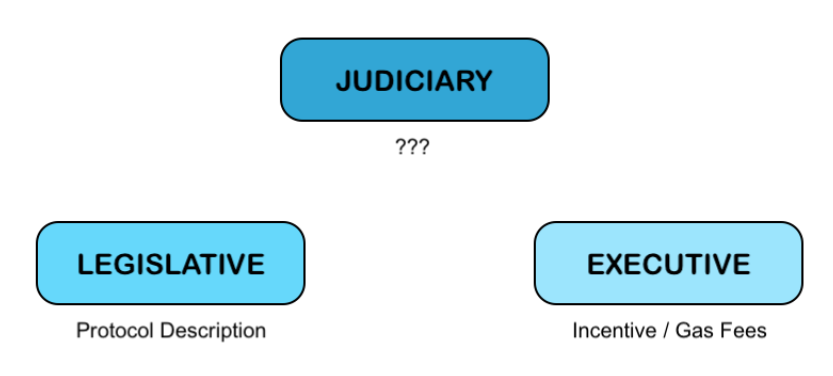
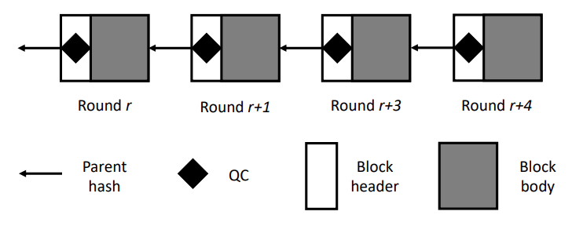

# XDPoS 2.0

## Introduction

Trust systems are a core construct of human societies. For centuries, mutually distrustful parties have collaborated to build empires, economies, and social structures. These collaborations and interactions, however, have historically been managed with opaque systems that are susceptible to corruption and extreme imbalance of power.&#x20;

Decentralized trust systems are digital systems in which multiple parties can collaborate on specific tasks without requiring parties to trust one another. An example of a task that requires decentralized trust is that of running a financial system, including payments. Decentralized trust systems promise panacea from the ills of centralization and associated corruptibility. Although decentralized computer systems have traditionally posed substantial technical challenges (e.g., scalability and security in peer-to-peer networks), substantial breakthroughs in blockchain technologies in recent years have paved the way for the mainstream development and deployment of decentralized trust systems:

### &#x20;Timeline of Blockchain developments.&#x20;

• **Blockchain 1.0**: Bitcoin and proof of work (PoW). Highly secure protocol and system design with guaranteed consensus as long as majority of hash power is honest. The major drawback is that the system is very inefficient. The inefficiencies are in energy as well as in scalability: poor throughput (only a handful of transactions per second) and poor latency (hour of confirmation time). Summary: This era resulted in the first construction of a permissionless blockchain that provides an immutable ledger with extremely strong security properties and resistance to malicious actors, only now being fully explored.&#x20;

• **Blockchain 2.0**: Ethereum and programmable smart contracts. This design maintains the security of Bitcoin (and its scalability deficiencies) but adds a general purpose programmable platform, allowing a large family of applications. _Summary_: This era resulted in the invention of EVM (Ethereum Virtual Machine), the “blockchain computer", allowing general purpose software programs to be implemented atop the blockchain.&#x20;

• **Blockchain 3.0**: _Proof of Stake_ (PoS). The PoS protocols eschew the energy consuming PoW mining process and simultaneously allow high throughput and low latency (e.g., Ouroboros, SnowWhite, Algorand, Hotstuff, Tendermint). The PoS blockchain protocols have been constructed from a family of protocols guaranteed to provide consensus even when a fraction of participants act maliciously (so-called Byzantine behavior) - known as BFT (Byzantine Fault Tolerant) protocols in Computer Science. _Summary_: This era focused on the scaling problem of blockchains, improving throughput and latency by orders of magnitudes.&#x20;

_Security of Blockchains_. A defining feature of blockchains is its security against adversarial actions, the so-called Byzantine fault tolerance. A standard format of expressing this security property is the following:&#x20;

_as long as a fraction x% of participation level is honest, i.e., follows protocol, then the security of the blockchain is guaranteed._&#x20;

In PoW blockchains like Bitcoin, the participation level is measured in mining hash power and the security threshold x is 0.5. In PoS blockchains like Algorand, the participation level is measured in staking power and security threshold x = 1 3 . In a BFT protocol such as Hotstuff, the participation level is measured in number of permissioned users and security threshold x = 1 3 . When the Byzantine participation level crosses the security threshold of x, security is not guaranteed: in fact, such a scenario represents a doomsday scenario and “all bets are off".

An alternative view point of this state of affairs is provided by anthropological studies of human governance systems. Over millennia, stable human governance systems have evolved to a three-party architecture: legislative, executive and judiciary wings. Indeed, this architecture is the dominant format in all extant governing systems. In the context of blockchains, the legislative aspect is clearly codified via the description of the protocol (the longest chain protocol in Bitcoin) and participation strategies (e.g., proof of work mining in Bitcoin). The executive branch is represented by the incentive (e.g., block rewards in Bitcoin) and taxing mechanisms (e.g., transaction fees (in Bitcoin and gas fees (in Ethereum). A striking aspect in all extant blockchain designs is the absence of a judiciary system; see Figure 1. Addressing this lacuna is the core goal of this whitepaper.&#x20;

<figure><figcaption>
Figure 1: Judiciary, a core component of governance, is missing in extant blockchain designs. Addressing this lacuna in a systematic manner represents the core goal of this whitepaper.
</figcaption></figure>

### Blockchain 4.0

_Accountability and Attributability_. Trust underlies human societies and key aspects of incentivizing and maintaining trustworthy behavior are the notions of accountability (viewed internally) and attributability (imposed externally). As an example, self-reporting financial statements (accountability) and auditing (attribution) are standard checks and balances of all financial systems. Key to mainstream blockchain adoption and usage, especially in the financial services sector, is to build accountability to blockchains. This notion of financial accountability was introduced in blockchains via the notion of slashing conditions in - however, this protocol was not completely specified and has since been overtaken by other versions in the development of Ethereum 2.0. In particular, no extant blockchain, either in production or design stage incorporates forensics holistically (one notable exception is, which aims to design new blockchains). We propose that the next era of blockchain designs will be focused on this key property, with XDC network spearheading this revolution, summarized as follows:&#x20;

`XDPoS 2.0 Credo: The blockchain is secure when sufficient participation is honest; conversely if security is breached, then every malicious actor is identified (with cryptographic integrity).`&#x20;

In this whitepaper, we detail the design of such a blockchain; we build on very recent academic research in pursuing this design process.

## XDPoS 2.0

Sitting at the core of the XDC Network, XinFin Delegated Proof-of-Stake consensus protocol 2.0 (XDPoS 2.0) regulates the XDC nodes in maintaining the consistency of a decentralized ledger (the blockchain) with strong security and performance guarantees. In this section, we provide an overview of XDPoS 2.0 by introducing its three pillars, including:

1. Master node election, which specifies how the delegation and proof-of-stake works.
2. The consensus engine, namely, the HotStuff state machine replication (SMR) protocol, which is the state-of-the-art BFT (Byzantine fault-tolerant) SMR (state-machine replication) protocol. An illustration of its position in XDPoS 2.0 and a brief security analysis will be provided.
3. Reward mechanism, which incentivizes nodes to join and maintain the XDC Network.&#x20;

### Master Node Election&#x20;

Unlike proof-of-work (PoW) which wastes resources and has low performance, XDPoS 2.0 uses Delegated Proof-of-Stake to decide which nodes have the right to create the next block and how the created block is approved. XinFin nodes that contribute in creating and approving blocks are referred to as master nodes. Only XinFin nodes that meet certain stake and hardware criteria are eligible as the master nodes. The eligible criteria are as follows:&#x20;

• More than 10,000,000 XDC deposited into the XinFin smart contract.&#x20;

• A suitable wallet to store XDC tokens. Preferably in hardware form.&#x20;

• A dedicated and stable hardware environment.&#x20;

• A dedicated Static Public IP address.&#x20;

• 100% network uptime by IDC network.&#x20;

• A minimum of tier 3+ IDC environment.&#x20;

• Virtual Private Server (VPS). Though this optional, this option is highly recommended.&#x20;

• When using cloud-based services like Amazon EC2 M3, large virtual machine (VM) sizes are appropriate. Similar configurations are applicable for the Microsoft Azure Cloud network users.

Once a node meets these criteria, it becomes a master node candidate and is eligible for master node elections that happen periodically. More specifically, time is partitioned into epochs. At the beginning of each epoch, a random set of 108 master candidates are elected as the master nodes of this epoch. These master nodes forms a BFT committee that is responsible for creating 900 consecutive blocks of the chain (the delegation). Every block is certificated by the super-majority of the committee (and thus is finalized) following the Hotstuff protocol. Sample aforementioned parameter values are:&#x20;

`VALIDATOR_SET_SIZE=108; EPOCH=900.`&#x20;

The random election can be achieved via various mechanisms:

1. Rank candidates by deposit and elect the top 108 candidates. 5
2. Using verifiable random functions (VRFs) to randomly elect 108 candidates. The probability of being elected should be proportional to deposit.&#x20;

XDPoS 2.0 will start with mechanism (1) for backwards compatibility, and can switch to mechanism (2) seamlessly for added fairness and security.&#x20;

Once the election is done, all nodes that are not elected will keep listening to messages sent by the HotStuff BFT committee and passively maintain the blockchain. We now introduce the HotStuff protocol.

### The HotStuff Protocol

#### &#x20;Protocol Description

HotStuff is a state-of-the-art Byzantine fault-tolerant (BFT) state machine replication (SMR) protocol widely used as an enterprise grade blockchain consensus engine, such as Facebook’s Novi and Diem (previously known as Libra) projects. Compared to the Nakamoto longest chain (BTC, ETH, etc), it has two distinct advantages:

1. Deterministic security (a.k.a. finality), which means zero forking / rollback on confirmed blocks as long as the fraction of adversary master nodes is less than 1/3. In contrast, Nakamoto only provides probabilistic security, that is, there is a non-zero chance of rollback.
2. Resiliency to network partial asynchrony, which means that HotStuff remains secure even if the network is temporarily not synchronous (e.g., temporary large latency between different sets of nodes). In contrast, Nakamoto is insecure under network partial asynchrony.&#x20;

#### Setup&#x20;

HotStuff aims at reaching consensus within a BFT committee, which is a deterministic set of nodes that know each other (recognizing their IP address, account address, and public key, etc.). In XDPoS 2.0, this BFT committee is the set of master nodes determined at the beginning of each epoch. Furthermore, these master nodes are ordered (e.g. by ascending order of their account address) to facilitate the protocol.&#x20;

The consensus to be reached in XDPoS 2.0 is about an ever-growing list of blocks. Each block has a parent hash pointer. Thus, together they form a blockchain. The transitive closure of the parent relation is called ancestors.&#x20;

The protocol is a leader-based one proceeding in rounds. Each round has a different leader, which is chosen among the ordered master nodes in a round-robin manner. In other words, the leader of round r (0 6 r < EP OCH) is the master node whose index is (r mod VALIDATOR\_SET\_SIZE). The role of a leader is to propose a new block and collect votes from the remaining nodes.&#x20;

#### Data Structure&#x20;

The block data structure is similar to that in Ethereum, except that a parentQC field is added to the block header. Here QC stands for quorum certificate. It is created by the leader of round-r for the block in r −1 (the parent block) when at least tH = dVALIDATOR\_SET\_SIZE × 2/3e master nodes have voted for this parent block, certifying that this parent block has been approved by the super-majority of the nodes. A QC contains the parent block hash1 , the round number, and the metadata such as signatures of the vote messages. In case of no proposal and/or a timeout in a round r − 1, nodes will send a "timeout" message for this round, and the leader of round r will gather tH of them into a timeout certificate (TC), so that this round can be dropped from the 1This parent hash is the same as header.parentHash. But we do not override header.parentHash for the sake of backwards-compatibility. 6 blockchain. We note that round number is not the same as block number - round number might be skipped in the blockchain but block numbers are guaranteed to be consecutive. Figure 2 shows an example of the main chain with QCs. Note that round r + 2 is skipped in the main chain due to timeout. The specification of data structures is provided in Algorithm 1.

<figure><figcaption>
Figure 2: XDC blockchain 
</figcaption></figure>

`Algorithm 1 Data Structures in the protocol`&#x20;

`block`

_`parentQC`_`: QC for the parent block, stored in header`&#x20;

_`parent`_`: short for parentQC.block`

&#x20;`. . .: other fields are the same as XDPoS 1.0`

`QC`

_`round`_`: the round of the voted block`&#x20;

_`block`_`: the hash of the voted block`&#x20;

_`signatures`_`: signatures of votes`&#x20;

`TC`&#x20;

_`round`_`: the round of the timeout`&#x20;

_`signatures`_`: signatures of timeout`&#x20;

#### Proposing and Voting&#x20;

Each round of HotStuff follows the proposing-voting paradigm: In each round r, the leader proposes a block and all master nodes vote. The leader of round r + 1 will collect these votes and aggregate them into a QC if there are tH votes. The leader of round r + 1 then proposes a child block of the block proposed in round r, and add the QC of the parent block to its header. Master nodes should obey the following rules regarding QC and TC:

1. Leader proposal. When a master node is the leader of a round, it must propose a new block where the parentQC field carries the latest QC it has received.
2. The locking rule. When a master node receives a valid proposal of a block with a parentQC , it locks on the parentQC contained in the parent block of the proposal, i.e., it locks on the grandparent block of the proposal. Once it locks on a block, it will ignore all the blocks that are not the offspring of this block, except under certain conditions (see the voting rule). The locking rule contributes to the guarantee that the HotStuff protocol has zero forking in finalized blocks/blockchain. 7
3. The voting rule. When a master node receives a proposal of a block, it votes for it only if it already locks on this block or this block’s ancestor. The only exception happens when the round of this proposal block’s parent block is higher than the block it locks on.
4. The finalization rule. Define a 3-chain as a tuple of 3 blocks \[b, b0 , b00] such that b = b 0 .parent and b 0 = b 00 .parent. When a node (either master or non-master node) receives a 3-chain of blocks in three consecutive rounds and an extra QC whose parentHash is the hash of b 00, it finalizes the first block b and all its ancestors.
5. Time out handling. If a master node does not receive any proposal for the current round within a certain time period, it must send a timeout message for this round. Sufficient (2/3 of the nodes) timeout messages can form a TC that helps master nodes to move on to the next round.&#x20;

The protocol is presented in Algorithm 2. Notice that we slightly abuse the notation by referring qc.block to the actual block instead of the block hash when the context is clear. And we omit the operations of verifying signatures of signed messages and verifying metadata in QC for simplicity.&#x20;

### Safety and Liveness Guarantee&#x20;

Safety Safety means any two honest nodes should agree on (finalize) the same XDC Network blockchain. And the HotStuff protocol ensures safety in the following two ways: safety within a round and safety across rounds.&#x20;

The HotStuff protocol requires that an honest master node only votes once in any round. Therefore, when the Byzantine adversary does not corrupt more than 1/3 master nodes, there cannot be two conflicting QCs within a round (a.k.a. no equivocation). This is because a valid QC requires 2/3 votes. The existence of two valid QC mean that more than 1/3 master nodes have double voted, which is not possible since it requires some honest master nodes to double vote together with all the 1/3 adversary nodes.&#x20;

When the adversary does not corrupt more than 1/3 master nodes, HotStuff ensures safety across rounds by the use of locks and the voting rule. If a QC for block b exists in round r, at least 2/3 master nodes lock on (r, b). In rounds higher than r, there could not be a QC on a conflicting block whose ancestors don’t include b, since such a QC means more than 1/3 master nodes who lock on (r, b) have voted for the conflicting block. This, in turn, means more than 1/3 master nodes violate the voting rule, which contradicts with our assumption of 1/3 adversary.&#x20;

#### Liveness&#x20;

Liveness means the blockchain makes progress and new transactions are included. When the leader is honest, the adversary does not corrupt more than 1/3 master nodes, and the network communication is synchronous, the HotStuff protocol ensures that a valid block with transactions can be generated. In addition, whenever this condition happens at four consecutive rounds (3-chain and an extra QC), the first two blocks are finalized.&#x20;

### Performance Guarantees

&#x20;The HotStuff protocol is optimistically responsive: in optimistic condition (honest leader and synchronous network), it only takes 3 block arrival time (BAT) to finalize a block and the transactions it contains. In practice, due to our strict network requirement on master nodes eligibility, the maximum network round-trip latency should be well below 2 seconds. Therefore, we can set BAT to be 2 seconds. This means that, in optimistic conditions, the finalization latency is only 6 seconds.&#x20;

**`Algorithm 2 HotStuff protocol`** \
`1: tH ← dVALIDATOR_SET_SIZE × 2/3e . constant` \
`2: highQC ← qcgenesis; lockQC ← qcgenesis . the latest QC and lock variable . Optimistic path` \
`3: for curRound ← 1, 2, . . . do` \
`4: as a leader` \
`5: generate proposal block b ∗ containing highQC and block content (transactions, etc.)` \
`6: broadcast hproposal, curRound, b∗ i` \
`7: as a master node` \
`8: on receiving hproposal, curRound, b∗ i from a leader` \
`9: if b ∗ satisfies the voting rule then` \
`10: send hvote, curRound, H(b ∗ )i to the next leader . H() means the hash digest` \
`11: highQC ← maxround{b ∗ .parentQC, highQC} . don’t update in case of a draw`\
`12: lockQC ← maxround{b ∗ .parentQC.block.parentQC, lockQC} . don’t update in case of a draw` \
`13: as the next leader` \
`14: if collect hvote, curRound, h∗ i from tH committee members for the same hash h ∗ then` \
`15: highQC ← QC generated from those vote messages . At any time in round curRound, as either master or non-master nodes` \
`16: upon receiving qc ← QC in proposal message do` \
`17: b 00 ← qc.block, b 0 ← b 00.parent, b ← b 0 .parent` \
`18: if b, b0 , b00 are in consecutive rounds then` \
`19: finalize blocks through b, execute transactions in the finalized blocks 20: if qc.round > curRound then` \
`21: curRound ← qc.round + 1 and go to the beginning of curRound . Non-optimistic path` \
`22: upon a local timeout do` \
`23: stop voting for curRound` \
`24: broadcast htimeout, curRoundi along with highQC` \
`25: if enter curRound due to a TC tc then` \
`26: broadcast tc` \
`27: upon receiving tH timeout messages for the same round do` \
`28: generate TC tc from them and broadcast tc` \
`29: upon seeing a TC tc do 30: if tc.round > curRound then 31: curRound ← tc.round + 1 and go to the beginning of curRound`&#x20;

In terms of overhead, the size of QC is only a few kilo bytes (for example, using the ETH 65-byte signature, a QC from 2/3 master nodes of a 108-node committee is only 65 ∗ 2/3 ∗ 108 = 4.68kB). This is much smaller than the common block size (e.g., ETH block size is about 60kB and is growing) and thus is negligible. Moreover, HotStuff’s communication complexity per round is linear to the product of committee size and block size, which is order-optimal.&#x20;

## Reward Mechanism

&#x20;One distinct feature of XDPoS 2.0 is that the blocks are finalized quickly, allowing the reward to be determined and announced instantly after the block is finalized. Since the optimal block finalization latency is 6 seconds, master nodes can expect to receive the reward in 6 seconds. Apart from the reduced reward latency, the reward mechanism remains the same as in XDPoS 1.0.
