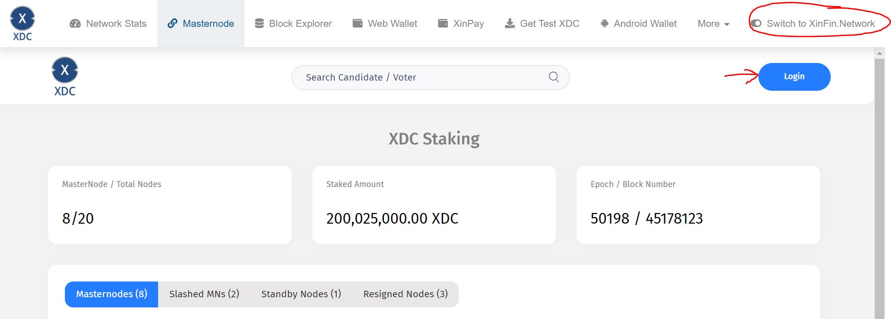
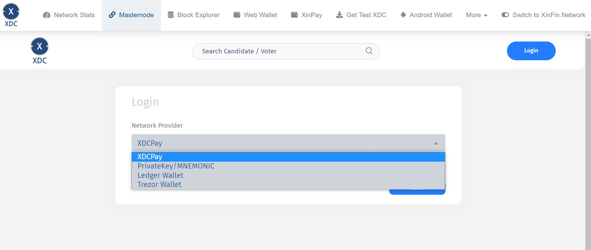
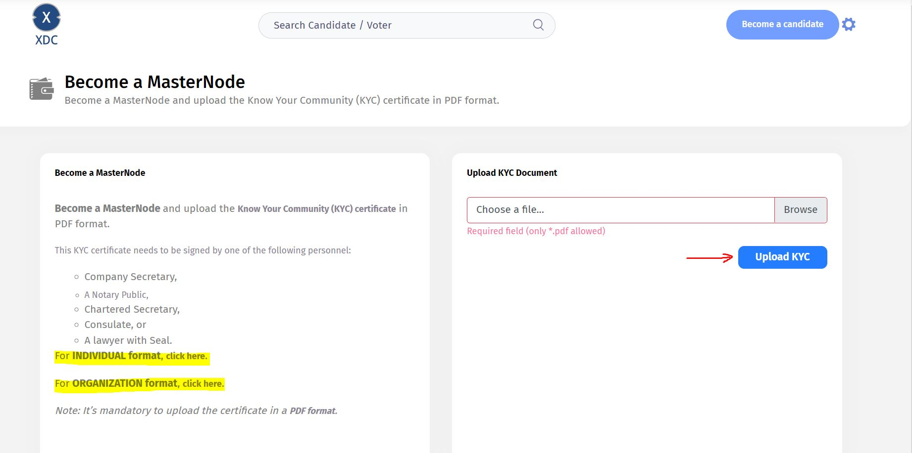
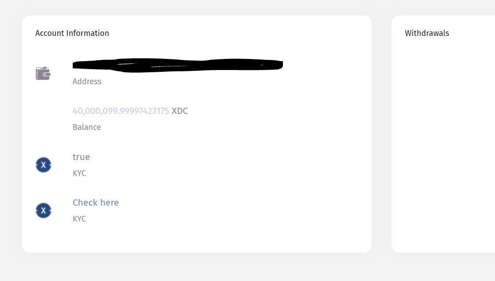
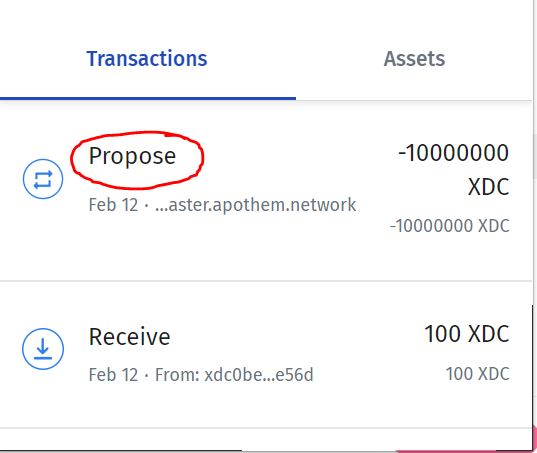

# How to Stake an XDC Masternode

As an XDC masternode candidate, you are going to need the following:&#x20;

1. XDCPay or XinFin web wallet or a hardware wallet (Trezor )
2. 10,000,000 XDC (mainnet) or test XDC (Apothem testnet)
3. Your coinbase address (you can log in to your node and retrieve it from there)

Follow these steps to stake your node.



1. Go to [https://www.xinfin.network/#masternode](https://www.xinfin.network/#masternode) and switch to either mainnet or Apothem:&#x20;
2.  Click on login

    <figure><figcaption></figcaption></figure>
3. You will be presented with the following options to log in. We will be using XDCPay for this tutorial:&#x20;

<figure><figcaption></figcaption></figure>

4. Once logged in, click on "Become a candidate" and you will see the following screen:

<figure><figcaption>
If you dont have your KYC document ready. You can download a copy via the highlighted links on this image. 
</figcaption></figure>

5. Once the file has been uploaded, you will see that KYC shows "True." At this point, your node is now staked with 10,000,000 XDC.  &#x20;

<figure><figcaption></figcaption></figure>

6. You can also verify the transaction if you open your wallet, click on "Transactions" and click on the "Propose" event. &#x20;
7.

    <figure><figcaption></figcaption></figure>
