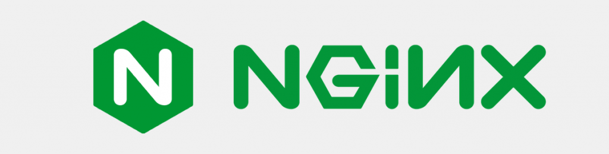
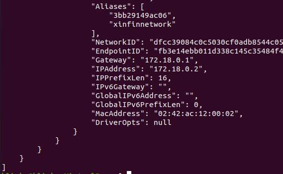
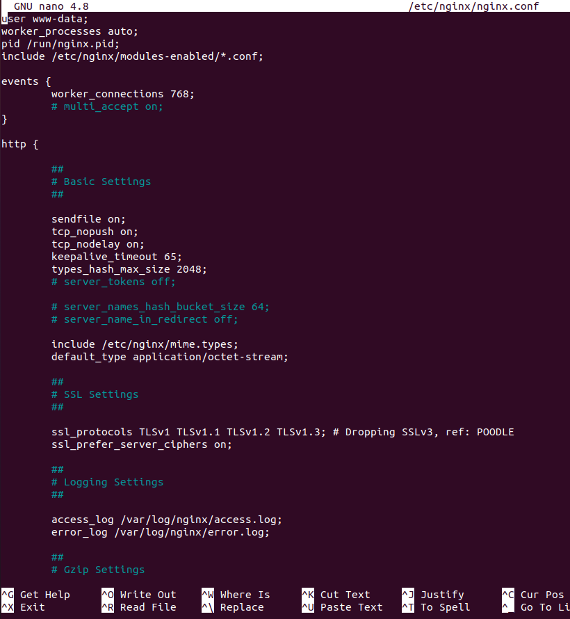
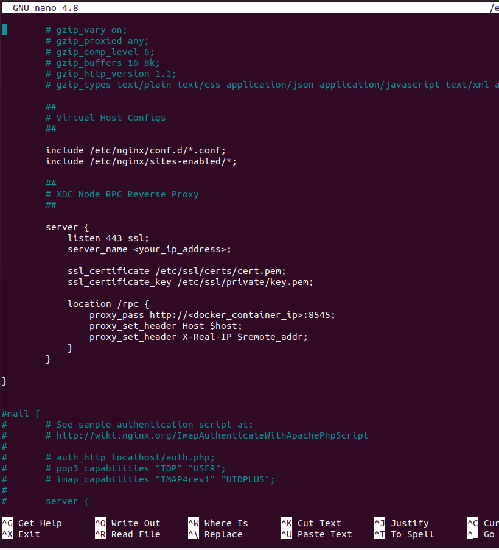

# SSL/TLS Encryption for XDC Node RPCs

_Note: These instructions relate to XDC Mainnet Nodes. For Apothem Testnet Nodes, Appendix A at the base of this article shows what process modifications you will need._

---

Implementing SSL/TLS encryption for XDC node RPCs offers key advantages. 

- SSL/TLS ensures the confidentiality of data exchanged between clients and nodes, guarding against unauthorized access. 
- It maintains data integrity, preventing tampering or unauthorized modifications during transit. 
- SSL/TLS authentication enhances trust by verifying the identities of the communicating parties, thwarting man-in-the-middle attacks. 

By protecting sensitive information and complying with security standards, SSL/TLS fortifies the overall security of XDC node RPCs.

---

<p align="center">
  
</p>

Nginx is a popular web server and reverse proxy server that efficiently handles and routes HTTP and other network protocols. We can use Nginx to establish SSL/TLS encryption for an XDC node's RPC by acting as a reverse proxy. 

To accomplish this, we need to:
1. Obtain an SSL/TLS certificate for the domain or IP address of the XDC node server
2. Configure Nginx with the certificate and set it up to listen for incoming encrypted connections
3. Configure Nginx to forward incoming encrypted connections to the local address and port of the XDC node's Docker container

We will now walk through these processes. After they are completed, we will secure our ports and test the new encrypted RPC!

---

## Obtain an SSL/TLS Certificate

SSL/TLS certificates can be obtained from a trusted third-party Certificate Authority (CA) or alternately, a self-signed certificate can be generated by the server itself. A CA certificate provides widespread recognition and trust, while a self-signed certificate provides encryption but lacks the third-party validation.

For the purposes of this article, we will be generating and using a self-signed certificate. _If choosing to use an official CA certificate, the setup processes other than generating a self-signed SSL certificate should remain the same._

We start by first connecting to your XDC node server. Remember to replace _root_ in this command with your actual username for the remote server, replace _22_ with the actual ssh port number you are using, and replace _ip.address_ with the actual IP address of the remote server:

```
ssh -lroot -p22 ip.address
```

Install OpenSSL:
```
sudo apt install openssl
```

Run the following command on your XDC node server to generate a private key _(key.pem)_ and self-signed SSL/TLS certificate _(cert.pem)_. You can vary your certificate's period of validity as desired. It is set below to 3065 days (~10 years):
```
sudo openssl req -x509 -nodes -days 3065 -newkey rsa:2048 -keyout /etc/ssl/private/key.pem -out /etc/ssl/certs/cert.pem
```

Fill in the required information when prompted. _Note that the Common Name (CN) field should be the public IP address of your server (or the domain if people will be using that)._

---

## Install and Configure Nginx

First we need to install Nginx:
```
sudo apt install nginx
```

We will shortly need to edit the Nginx configuration file and customise it. In order to make the necessary changes, you will need 2 pieces of information:
- the public IP address of your XDC node server (the same IP address you entered as the Common Name (CN) when setting up your SSL certificate above); and
- the local IP address being used by the XDC node's Docker container

To obtain the local IP address being used by the Docker container, use:
```
sudo docker inspect mainnet_xinfinnetwork_1
```

You will see a lot of configuration information relating to your Docker container shown in your terminal. The part you are looking for is the IP address shown after _"IPAddress":_. It is towards the end of the configuration information that is displayed in the terminal window. In the screenshot image below, we can see that this Docker container is using IP address _172.18.0.2_:

<p align="center">
  
</p>

Now open the Nginx configuration file in nano for editing:
```
sudo nano /etc/nginx/nginx.conf
```

It will look like this:

<p align="center">
  
</p>

Locate the http block in the nginx.conf file. It begins with the _http_ keyword and ends with a closing brace _}_. At the end of the http block (before the closing brace), add the following configuration:
```
        ##
        # XDC Node RPC Reverse Proxy
        ##

        server {
            listen 443 ssl;
            server_name <your_ip_address>;

            ssl_certificate /etc/ssl/certs/cert.pem;
            ssl_certificate_key /etc/ssl/private/key.pem;

            location /rpc {
                proxy_pass http://<docker_container_ip>:8545;
                proxy_set_header Host $host;
                proxy_set_header X-Real-IP $remote_addr;
            }
        }
```

After adding it, the part you have added to the file should look like this:

<p align="center">
  
</p>

In the configuration text you have just added we need to also:
- replace `<your_ip_address>` with the public IP address of the XDC node server; and
- replace `<docker_container_ip>` with the IP address we obtained by using the _docker inspect_ command above

Then save the changes and exit nano:

> Press "CTRL+X" 
> Press "y"
> Press "ENTER"

Check that the syntax you have entered in nginx.conf is ok:
```
sudo nginx -t
```

We will need to set the ownership and permissions of the private key and certificate we created earlier. This makes sure they are secure. We also need to ensure that Nginx can access them when needed. The Nginx process usually runs as _www-data_, so we will add _www-data_ to the group _ssl-cert_ that has access to the credentials:
```
sudo chown root:ssl-cert /etc/ssl/certs/cert.pem
sudo chmod 0644 /etc/ssl/certs/cert.pem
sudo chown root:ssl-cert /etc/ssl/private/key.pem
sudo chmod 0640 /etc/ssl/private/key.pem
sudo usermod -a -G ssl-cert www-data
```

Restart the Nginx service:
```
sudo systemctl restart nginx
```

---

## Port Considerations

At this point, your XDC Mainnet node is now using:
- port 443 for HTTPS access to the XDC RPC; and
- port 30303 for peer-to-peer communications; and
- whichever port you have set to access the server by ssh

In the majority of cases, we should now block (filter) port 8989 with our firewall as plain HTTP access to the RPC is no longer required and defeats the purpose of securing the RPC with SSL. You will of course need to consider your port requirements based on whatever your node is being used for.

---

## Test your new SSL/TLS Encrypted RPC

You can now test the HTTPS access to your XDC Node RPC by using a web browser and going to `https://<your_nodes_ip_address>/rpc` _(or if you just go to `https://<your_nodes_ip_address>` you will see the Nginx information page._

As we are using a self-signed certificate, we expect that there would be an "Untrusted certificate warning" which we will need to just set an exception for in the browser. If using a CA certificate instead, this warning will not occur.

Congratulations you have just set up SSL/TLS encryption for your XDC Mainnet RPC!

---

<p align="center">
  
</p>

## Appendix A - Modifications for Apothem Testnet Nodes

### Modification 1

When obtaining the local IP address being used by the Docker container, we need to use the testnet container name as shown here:
```
sudo docker inspect testnet_xinfinnetwork_1
```

### Modification 2

When adding the extra configuration information to the nginx.conf file, we must allow for the different HTTP-RPC port used by the Apothem Testnet Client. We can use the following configuration text instead of the mainnet version above:
```
        ##
        # Apothem Node RPC Reverse Proxy
        ##

        server {
            listen 443 ssl;
            server_name <your_ip_address>;

            ssl_certificate /etc/ssl/certs/cert.pem;
            ssl_certificate_key /etc/ssl/private/key.pem;

            location /rpc {
                proxy_pass http://<docker_container_ip>:8555;
                proxy_set_header Host $host;
                proxy_set_header X-Real-IP $remote_addr;
            }
        }
```

### Modification 3

After restarting the Nginx service, we note that the Apothem Testnet node is now using:
- port 443 for HTTPS access to the XDC RPC; and
- port 30304 for peer-to-peer communications; and
- whichever port you have set to access the server by ssh

In the majority of cases, we should now block (filter) port 8999 with our firewall as plain HTTP access to the RPC is no longer required and defeats the purpose of securing the RPC with SSL. You will of course need to consider your port requirements based on whatever your node is being used for.

Congratulations you have just set up SSL/TLS encryption for your Apothem Testnet RPC!

---
