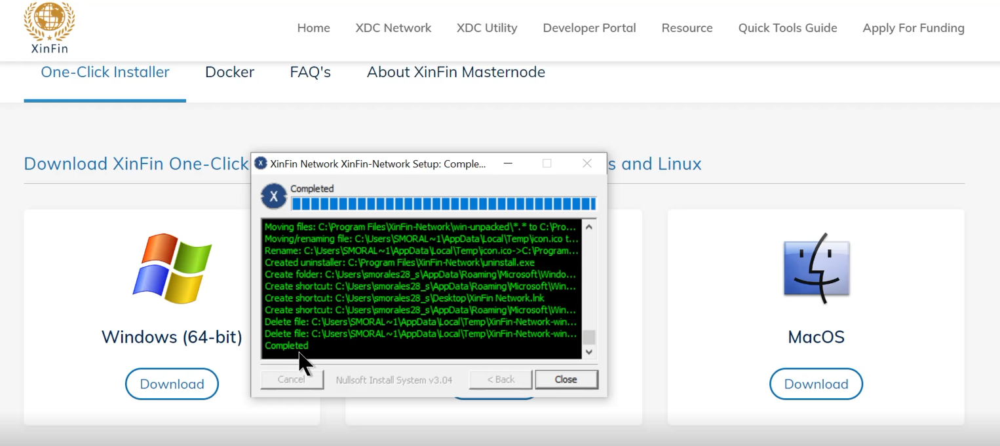

# Masternode

## Method 1:&#x20;

There are 3 ways that an XDC Network Masternode can be deployed.  One way is the one-click installer, as shown here:&#x20;

<figure><figcaption></figcaption></figure>

You can find the instructions [here](https://xinfin.org/setup-masternode) or visit the [Github](https://github.com/XDCFoundation/XDCNetwork-Masternode) repository and follow the "Method 1". &#x20;

## Method 2&#x20;

The second way is to set up an XDC Network Masternode via a Bootstrap script by following the steps described [here](https://github.com/XinFinOrg/XinFin-Node).&#x20;

<figure><figcaption></figcaption></figure>

## Method 3

The third way to deploy a node is via Docker and it supports the followin Operating Systems:&#x20;

<figure><figcaption>
These are the minimum requirements to run a XDC Masternode on a server or virtual private server (VPS) provider. 
</figcaption></figure>

Find the instructions on how to deploy the Masternode on the Github repository [here.](https://github.com/XinFinOrg/XinFin-Node)&#x20;
