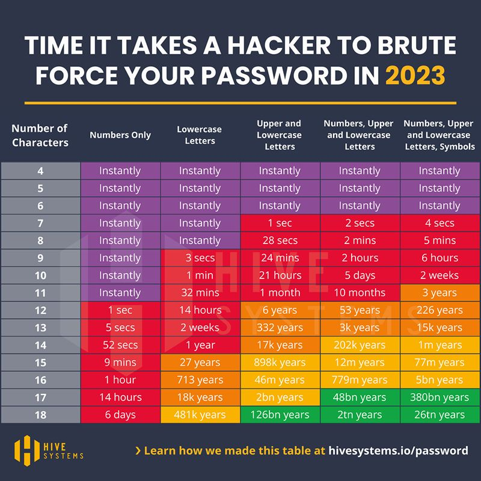
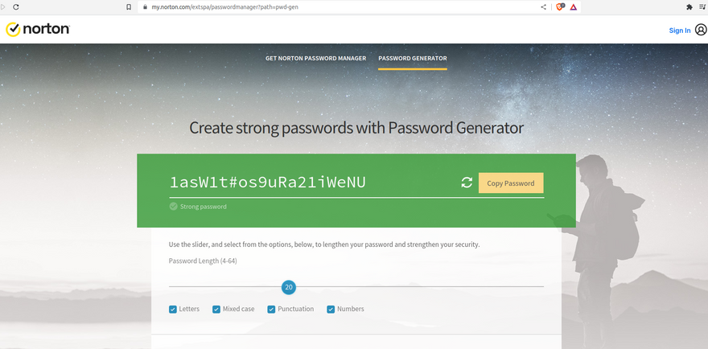
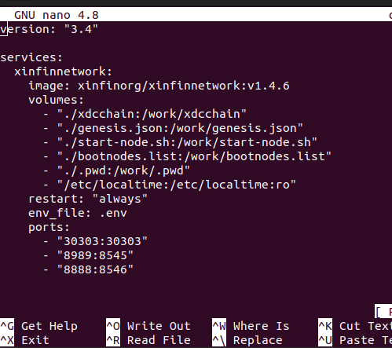
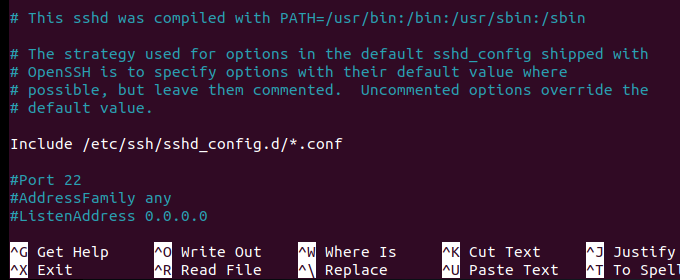
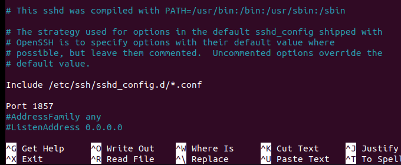
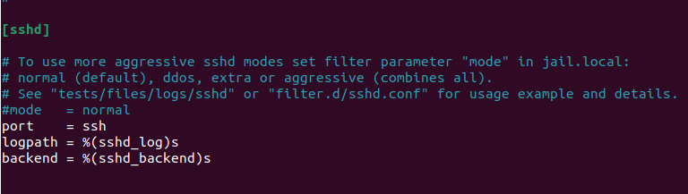
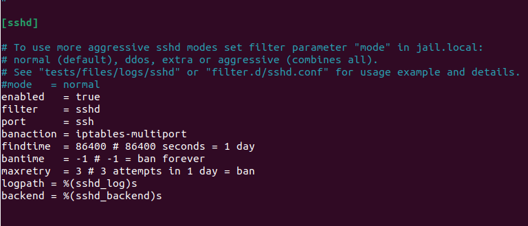
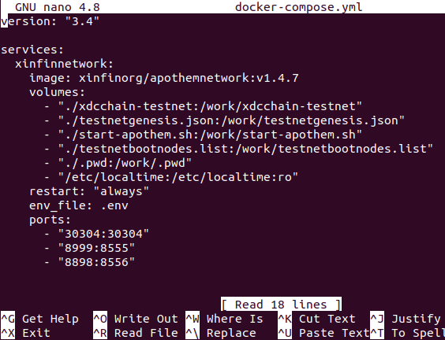

# Securing your XDC Masternode 

_Notes:_
- _Although this guide refers to masternodes, it will also work for standby
nodes as well as non-validator nodes (as long as they are reachable via a public
IP address). For non-validator nodes using HTTP/Websocket JSON-RPC connection,
you'll also need to take into account your specific port access requirements
when dealing with ports 8888 and/or 8989._
- _For Apothem Testnet Nodes, Appendix A at the base of this article shows what
process modifications you will need._
- _Instructions are for a Docker node running on Ubuntu 20.04LTS_

---

XDC network masternodes are important because they validate transactions, help
to maintain the network's security and integrity, and ensure that the network
runs smoothly. Securing your node will help with all of these issues.

From a high-level consideration, to secure your XDC masternode you would need to:
1. Keep it up-to-date with the latest security patches.
2. Use a strong and unique password.
3. Change your SSH port and enable firewall rules to restrict access to the node.
4. Use SSL/TLS encryption to secure communication with it.
5. Implement access controls to limit who can interact with it.
6. Regularly monitor it for any suspicious activity or unauthorized access attempts.

We will deal with each of these in turn below.

---


## Keeping your node up-to-date with the latest security patches

This has 2 components. Component 1 is the server OS. Component 2 is the XDC client.

### Regarding the Server OS

As per [XinFin's original XDC network node setup instructions](https://xinfin.org/setup-masternode) 
deploying an XDC node by the Docker method is supported on CentOS, RedHat
Enterprise Linux (latest release) and Ubuntu 15.04+.

Each OS vendor has a period for which its product is supported. For example we
can see in the image below that Ubuntu 20.04LTS has hardware and maintenance
updates until 2025 as well as Extended Security Maintenance until 2032.
Ensure your OS is supported with current updates.

<p align="center">
  
</p>

To update the OS packages on your server we first need to connect to the remote
server so we can then do all the following steps on the remote server. Remember
to replace “root” in this command with your actual username for the remote
server, and replace ip.address with the actual IP address of the remote server:

```
ssh -lroot -p22 ip.address
```

Update the OS packages:

```
sudo apt update -y && sudo apt upgrade -y && sudo apt autoremove -y
```

Many OS updates often require you to reboot your server, but we must first stop
the XDC client. To do this, first change to the Mainnet client directory:

```
cd ~/XinFin-Node/mainnet
```

Stop the XDC client:

```
sudo ./docker-down.sh
```

Reboot the server:

```
sudo reboot
```

You’ll notice this has disconnected your Terminal from the VPS while it reboots.
Allow enough time for the VPS to reboot, then reconnect to your VPS as you
normally would. Remember to replace “root” with your actual username for the
remote server, and replace ip.address with the actual IP address of the remote
server:

```
ssh -lroot -p22 ip.address
```

Change to the Mainnet client directory:

```
cd ~/XinFin-Node/mainnet
```

Start the XDC Client:

```
sudo ./docker-up.sh
```

Logout of your server:

```
logout
```


### Regarding the XDC Network Client

Connect to your VPS as you normally would. Remember to replace “root” with your
actual username for the remote server, and replace ip.address with the actual
IP address of the remote server:

```
ssh -lroot -p22 ip.address
```

Change to the Mainnet client directory:

```
cd ~/XinFin-Node/mainnet
```

In the Mainnet client directory there is a script we can run to upgrade the XDC
network configuration scripts and the Docker images. _Note that as part of the
process it will stop and start the XDC client, so expect to see your peers drop
on [the XDC Foundation Network Stats page](https://stats.xdc.org)_. To run the
upgrade script:

```
sudo ./upgrade.sh
```

Logout of your server:

```
logout
```


---

## Using a strong and unique password

The time it takes to guess passwords by brute force depends on the length and
complexity of the password, as well as the computing power of the attacker. It
can range from a few seconds to several years or even centuries (or even longer!).

As per the image below (sourced from Hive Systems), in 2023 an 18 character
password consisting of only numbers can take as little as 6 days to obtain
by brute force. Using the same length password but including random numbers,
upper and lowercase letters as well as symbols, can increase the brute force
time to 26 trillion years with the same computing power.

<p align="center">
  
</p>

Ensuring that a password is not reused is also important. If the same password
is used on multiple sites then if ANY of those sites are compromised and your
password is somehow obtained, it could potentially allow unauthorised parties
to access other accounts/services where you have reused the same password.

If you have difficulty generating a random password with the criteria described
above, there are online password generators from reputable vendors. One example
of this is the [Norton Password Generator](https://my.norton.com/extspa/passwordmanager?path=pwd-gen)

<p align="center">
  
</p>

If you already have an existing password and would like to change it, you can
do so by first connecting to your VPS as you normally would. Remember to
replace “root” with your actual username for the remote server, and replace
ip.address with the actual IP address of the remote server:

```
ssh -lroot -p22 ip.address
```

Change your password with the following command. Replace `<username>` with the
actual username of the user whose password you want to change. You will be
prompted to enter and confirm the new password:

```
sudo passwd <username>
```

Logout of your server:

```
logout
```

_Note: another alternative is to setup ssh key-based authentication and then to
disable the ability to use password logins. This will not be covered in this
article. If there is demand, I'll consider covering it in a future article._

---

## Change your SSH port and enable firewall rules to restrict access to the node

Securing the server ports and RPC endpoint is important to prevent unauthorized
access and potential security breaches such as execution of malicious code.

<p align="center">
  
</p>

Those who were around at the time may remember that the Andromeda update to the
XDC network implemented an upgrade to Geth 1.9.X.
From examining an XDC node's docker-compose.yml file shown in the image below, we
can see that Geth nodes on the XDC network use:
- Port 30303 for RLPx(TCP)/UDP peer-to-peer communications allowing node discovery
and connection to peers
- Port 8989 for HTTP JSON-RPC API which allows external applications to interact
with the XDC blockchain
- Port 8888 for secure Websocket communications to the XDC blockchain

<p align="center">
  
</p>

In addition Linux servers normally have their SSH port set at 22 by default, and
this is used to connect to the server and access its command line.

For the purposes of this article, we will assume that your masternode is being
used only for the purpose of maintaining the XDC blockchain and does not require
RPC/Websocket access for external applications to use.

Based on the above, the best way of securing our node with a firewall is to:
- Change our SSH port from 22 to a different number to make it harder for random
malcontents to connect
- Use a firewall to block ALL incoming ports
- Then open ONLY ports 30303 and our new SSH port
- We will leave ports 8888 and 8989 blocked (filtered) as we are assuming that
these are not needed as noted above

To change the port used for SSH on Ubuntu, you need to first connect to your VPS
as you normally would. Remember to replace “root” with your actual username for
the remote server, and replace ip.address with the actual IP address of the
remote server:

```
ssh -lroot -p22 ip.address
```

Next you need to edit the SSH configuration file located at /etc/ssh/sshd_config :

```
sudo nano /etc/ssh/sshd_config
```

Look for the line that says "Port 22". If there is a `#` before "Port 22" as
in the image below, you'll need to delete the `#` symbol:

<p align="center">
  
</p>

Change the number 22 to whatever new port number you want to use for SSH connections:

<p align="center">
  
</p>

Save the file:

> Press "CTRL+X"
> 
> Press "y"
> 
> Press "ENTER"

Then restart the SSH service:

```
sudo service ssh restart
```

_Note: Whenever we have previously used "-p22" as part of our command to connect
to a VPS via SSH, this is specifying to ssh what port the remote server is using
for ssh. From now on whenever you connect to your XDC node, you will need to
change the 22 in "-p22" to your new port number instead._

<p align="center">
  
</p>

Now to implement a firewall we will use UFW (Uncomplicated Firewall) which is
a front-end tool for managing firewall rules on Ubuntu.

First we need to install ufw:

```
sudo apt install ufw
```

Next we establish our default policies to block ALL incoming traffic and only
allow outgoing traffic:

```
sudo ufw default deny incoming
sudo ufw default allow outgoing
```

Then we open up port 30303 so the XDC client is discoverable by peers:

```
sudo ufw allow 30303
```

**IMPORTANT: Next we need to ensure that we open up our SSH port (22 or whatever
port number you changed it to):**

```
sudo ufw allow <yourSSHport>
```

Lastly we need to enable UFW:

```
sudo ufw enable
```

Reboot your server:

```
reboot
```

Now ssh to your server to test your new port number instead of 22 and ensure
that you can connect ok. 

If you are unable to connect and need to get back to the command line on your
server to modify the firewall details, most VPS providers will have a console
for the server directly accessible through their VPS control panel. So you
just need to go to your VPS provider website, login and find the console for
the VPS running your XDC client. Then login and do what you need to do. 

After rebooting, we will need to restart the XDC Mainnet client, so first we
need to SSH to our VPS:

```
ssh -lroot -p<yourSSHport> ip.address
```

Change to the XDC Mainnet client directory:

```
cd ~/XinFin-Node/mainnet
```

Restart the XDC Mainnet client:

```
sudo ./docker-up.sh
```

Then logout of your VPS:

```
logout
```

_Note: In another section of this book we will be making some further
adjustments allowing certain IP addresses restricted access to port 8989
(HTTP JSON-RPC) in the firewall rules._

---

## Use SSL/TLS encryption to secure communication with the node

SSL/TLS encryption makes things safer if external applications are using
the JSON-RPC (HTTP/Websocket) functionalities of your node to communicate
with the XDC blockchain. The assumption of this page is that your node
is not being used for this so this issue will be covered in another section.

---

## Implement access controls to limit who can interact with the node

This involves:
* Configuring firewall rules to restrict access to the node from specific
IP addresses or networks.
* Setting up RPC authentication on Geth

These are not relevant to a masternode (with its RPC port filtered) and
will be covered in other sections of this book.

---

## Regularly monitor it for any suspicious activity or unauthorized access attempts

You can regularly monitor an XDC node for any suspicious activity or
unauthorized access attempts by setting up alerts and notifications for any
unusual activity and regularly reviewing logs and metrics. Additionally,
you can consider using third-party security tools and services to enhance
your node's security. Usage of monitoring should not however replace
implementing security best practices such as using strong passwords
and keeping your software up to date. 

Many VPS providers will have some kind of VPS monitoring in place which
is already accessible via their control panel and generally includes
alerts when certain preset VPS parameter limits (eg CPU usage, memory
usage, network traffic, disk I/O) are breached. If your VPS provider does
not provide this, third party solutions such as Netdata can be used to
provide it. Netdata will be covered in another section.

<p align="center">
  
</p>

Implementing the fail2ban linux package can also be useful for keeping
your node safe by blocking IP addresses that attempt to access the node
with incorrect login credentials or perform suspicious activities.

Install fail2ban:

```
sudo apt install fail2ban
```

Next we create a copy of the configuration file for us to customise:

```
sudo cp -p /etc/fail2ban/jail.conf /etc/fail2ban/jail.local
```

Open the new file in nano so we can configure fail2ban:

```
sudo nano /etc/fail2ban/jail.local
```

Scroll down until you find this sshd section:

<p align="center">
  
</p>

Replace the 3 white lines shown above with all of these lines:

> enabled   = true
> 
> filter    = sshd
> 
> port      = ssh
> 
> banaction = iptables-multiport
> 
> findtime  = 86400 # 86400 seconds = 1 day
> 
> bantime   = -1 # -1 = ban forever
> 
> maxretry  = 3 # 3 attempts in 1 day = ban
> 
> logpath = %(sshd_log)s
> 
> backend = %(sshd_backend)s

<p align="center">
  
</p>

Save the file:

> Press "CTRL+X"
> 
> Press "y"
> 
> Press "ENTER"

Restart fail2ban:

```
sudo systemctl restart fail2ban
```

Logout of your server

```
logout
```

**Commands to use fail2ban**

To check who is banned:

```
sudo fail2ban-client status sshd
```

To unban an IP address:

```
sudo fail2ban-client set sshd unban <ip address>
```

If you manage to ban yourself by using incorrect passwords etc, you can use
the direct console on your VPS provider's control panel to access the command
line of your VPS (same as described in the Firewall section above) and unban
your IP address using the above command.

---

In conclusion, securing XDC nodes is crucial to protect the network from
potential attacks and ensure the safety of user funds. By implementing
the methods discussed in this article, such as using strong passwords,
enabling firewalls, regularly updating software, and using monitoring
tools, node operators can significantly increase the security of their
nodes. It is important to stay vigilant and proactive in maintaining
node security to prevent any potential breaches. With these measures in
place, the XDC network can continue to operate securely and efficiently.

---

<p align="center">
  
</p>


# Appendix A - Securing your Apothem Testnet Masternode

## Keeping your node up-to-date with the latest security patches

Once again we separately consider the server OS and the Apothem Testnet
client.

### Regarding the Server OS

Updating the OS packages on your server is very similar to the Mainnet
instructions but with a minor path adjustment to the testnet directory
when stopping and restarting the client. When using ssh to connect to
your server, remember to replace “root” in the command with your actual
username for the remote server, and replace ip.address with the actual
IP address of the remote server:

```
ssh -lroot -p22 ip.address
```

Then:

```
sudo apt update -y && sudo apt upgrade -y && sudo apt autoremove -y
cd ~/XinFin-Node/testnet
sudo ./docker-down.sh
sudo reboot
```

After your server has rebooted we need to reconnect to it and restart
the Apothem client. First step is to reconnect:

```
ssh -lroot -p22 ip.address
```

Then restart the client:

```
cd ~/XinFin-Node/testnet
sudo ./docker-up.sh
logout
```

### Regarding the Apothem Testnet Client

At present there is no upgrade script for the Apothem Testnet client.
The Apothem tree can be [seen here](https://github.com/XinFinOrg/XDPoSChain/tree/apothem) and docker image versions
can be [seen here](https://hub.docker.com/r/xinfinorg/xinfinnetwork/tags).

There is nothing extra to do here.

---

## Using a strong and unique password

No changes from the Mainnet section of the page above.

---

## Change your SSH port and enable firewall rules to restrict access to the node

Ports on the Apothem Testnet client are different to those on the Mainnet
client. From examining an Apothem Testnet client's docker-compose.yml
file shown in the image below, we can see that clients on the Apothem
Testnet use:
- Port 30304 for RLPx(TCP)/UDP peer-to-peer communications allowing node
discovery and connection to peers
- Port 8999 for HTTP JSON-RPC API which allows external applications to
interact with the Apothem blockchain
- Port 8898 for Websocket communications between external applications and
the Apothem blockchain

<p align="center">
  
</p>

The processes for securing the ports of your server running the Apothem
Testnet client are similar to those for the Mainnet client. As previously,
we will assume that your masternode is being used only for the purpose of
maintaining the Apothem Testnet blockchain and does not require
RPC/Websocket access for external applications to use. _(If you are using
ports 8898 and/or 8999, you will need to ensure they are open for whatever
access you require)._ The steps we will use are:
- Change our SSH port from 22 to a different number to make it harder for
random malcontents to connect
- Use a firewall to block ALL incoming ports
- Then open ONLY ports 30304 and our new SSH port
- We will leave ports 8898 and 8999 blocked (filtered) as we are assuming
that these are not needed as noted above

Changing the SSH port from 22 to a different number uses exactly the same
steps as in the Mainnet article. Please follow the steps in the Mainnet
article to modify /etc/ssh/sshd_config

Then restart your ssh service with:

```
sudo service ssh restart
```

_Note: Whenever we have previously used "-p22" as part of our command to
connect to a VPS via SSH, this is specifying to ssh what port the remote
server is using for ssh. From now on whenever you connect to your Apothem
Testnet node, you will need to change the 22 in "-p22" to your new port
number instead._

<p align="center">
  
</p>

Same as for the Mainnet nodes, we will use ufw for our firewall
configuration. Install ufw:

```
sudo apt install ufw
```

Establish our default policies to block ALL incoming traffic and only
allow outgoing traffic:

```
sudo ufw default deny incoming
sudo ufw default allow outgoing
```

Open up port 30304 so the Apothem Testnet client is discoverable by peers:

```
sudo ufw allow 30304
```

**IMPORTANT: Next we need to ensure that we open up our SSH port (22 or
whatever port number you changed it to):**

```
sudo ufw allow <yourSSHport>
```

Enable UFW then stop the Apothem Testnet client and reboot the server:

```
sudo ufw enable
cd ~/XinFin-Node/testnet
sudo ./docker-down.sh
sudo reboot
```

Now ssh to your server to test your new ssh port number. 

If unable to connect, find the console for that VPS on your
VPS-provider’s website. Use it to login and do whatever you need to do. 

After rebooting, we need to restart the Apothem Testnet client, so first
SSH to the VPS:

```
ssh -lroot -p<yourSSHport> ip.address
```

Restart the Apothem Testnet client and logout of your server:

```
cd ~/XinFin-Node/testnet
sudo ./docker-up.sh
logout
```

---

## Use SSL/TLS encryption to secure communication with the node

No changes from the Mainnet section of the page above.

---

## Implement access controls to limit who can interact with the node

No changes from the Mainnet section of the page above.

---

## Regularly monitor it for any suspicious activity or unauthorized access attempts

No changes from the Mainnet section of the page above.

---
