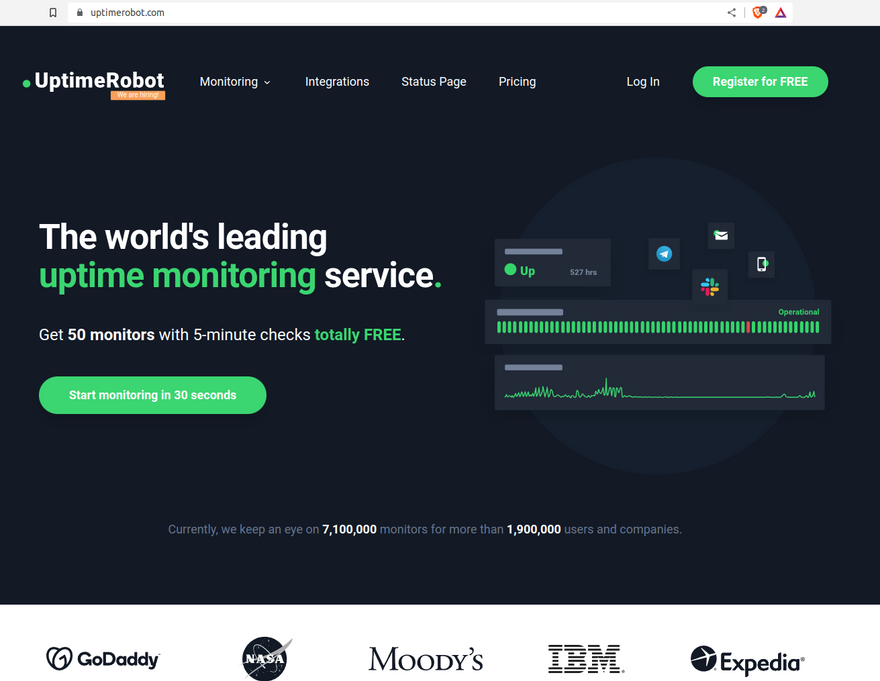
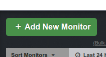
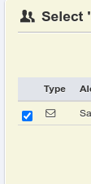
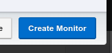
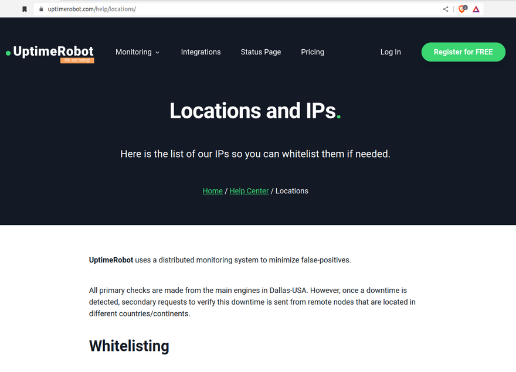
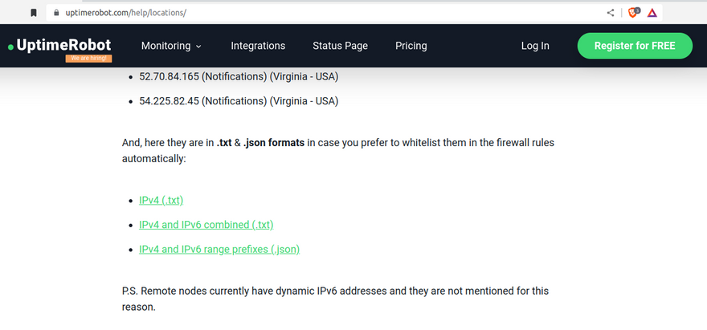
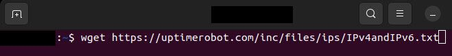
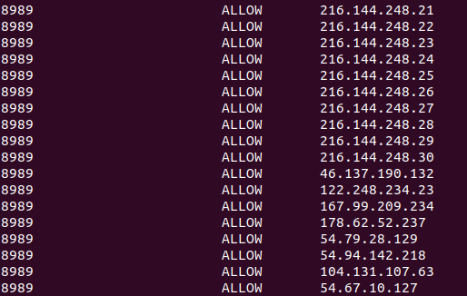
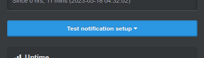

# How to Monitor Uptime

## Uptime Monitoring for XDC Masternodes

_Notes:_

* _Although this guide refers to masternodes, it will also work for standby nodes as well as non-validator nodes (as long as they are reachable via a public IP address). For non-validator nodes using HTTP/Websocket JSON-RPC connection, you'll also need to take into account your specific port access requirements when dealing with ports 8888 and/or 8989._
* _For Apothem Testnet Nodes, Appendix A at the base of this article shows what process modifications you will need._
* _Instructions are for a Docker node running on Ubuntu 20.04LTS_

***

It is important for XDC Network masternode operators to ensure that their nodes are online and working properly because masternodes play a crucial role in the network's security, stability, and performance. If a masternode goes offline or malfunctions, it can negatively impact the network's overall functionality and potentially compromise its security. Additionally, masternode operators receive rewards for their participation in the network, so ensuring their nodes are online and functioning properly is necessary to receive those rewards.

Uptime Robot is a powerful tool that can be used to monitor the status of an XDC masternode (or standby/non-validator node). It does so by regularly pinging your server and also by sending HTTP requests to the RPC endpoint and checking for a successful response.

By setting up Uptime Robot to monitor your masternode, you can receive real-time notifications if your server goes offline or if your XDC client experiences any issues that have taken its RPC endpoint offline. This can help you ensure that your masternode is always up and running. In this guide, we will walk you through the process of safely setting up Uptime Robot to monitor your XDC masternode.



***

### Registering on Uptime Robot

1. Go to the Uptime Robot website at http://uptimerobot.com
2. Click on the "Register for FREE" button.
3. Enter your name, email address and a password.
4. Click on the "Create My Account" button.
5. Verify your email address by clicking on the link sent to your email.
6. Log in to your account and start monitoring your node(s).

***

### Creating a monitor that will intermittently ping your node server

1. Login to the Uptime Robot website.
2. Click on the "Add new monitor" button to the top left of the page.



3. From the "Monitor Type" select the "Ping" option.


4. Then in the "Friendly Name" field, type a nickname for this alert.


5. Put your node's IP address in the "IP" field.
6. Move the "Monitoring Interval" slider bar to 5 mins. A free 5 minutely check will be great for our general purposes at this point. (Any more frequent checks than this require a paid account).
7. In the yellow box you will see the “Select Alert Contacts to Notify” section. Place a check mark next to your email address.



8. Then click on the blue "Create Monitor" button at the bottom right of the popup window.



***

### Creating a monitor for your node's RPC endpoint

When opening the access port for a node's RPC endpoint, we must ensure that we do it in a secure fashion to prevent unauthorized access and potential attacks on the node, including manipulation of data, or disruption of the network.

One way we can securely do this is by restricting access to the RPC endpoint by allowing only trusted IP addresses to connect to it. To do this, we will need to make some special rules for the firewall running on the node.

We first need to know which IP addresses Uptime Robot sends HTTP requests from. Uptime Robot helpfully provides this information on their website on [THIS PAGE](https://uptimerobot.com/help/locations/) shown in the image below.



Towards the bottom of the page they provide some green coloured links to files containing a list of the relevant IPv4 and IPv6 addresses that we will need to whitelist on our firewall. Right click on the _"IPv4 and IPv6 combined (.txt)"_ link on that page and copy the link URL.



Store the link URL by pasting it to a notepad if needed. We will need to use it shortly on our Terminal.

For the following steps to work, I am assuming that you have set up the firewall on your server using ufw as per the instructions on [THIS PAGE](securing-your-xdc-masternode.md). If you have not done so, please go to that page and follow the instructions in the section on setting up your ssh port and firewall.


After following the setup instructions there, you will have:

* Moved your SSH port from 22 to something else
* Have installed ufw
* Established a default policy that blocks all incoming connections (with the 2 exceptions of port 30303 and whichever port you chose to use for SSH)
* Left ports 8888 and 8989 blocked (filtered) on the assumption that the node is not being used by external applications to access the XDC blockchain via Websocket/HTTP JSON-RPC

From this point on, we assume those steps are done and that is how your firewall setup looks.

Now open up a terminal window and ssh to your node server. When using the following command, remember to replace “root” in this command with your actual username for the remote server, replace the "22" with whichever port you have set up for ssh on your server, and replace "ip.address" with the actual IP address of the remote server:

```
ssh -lroot -p22 ip.address
```

In the terminal, we will now download the file containing the list of Uptime Robot IP addresses for us to Whitelist. To do this we will use the "wget" command and paste the link URL we copied from the Uptime Robot website after it:

```
wget <URLtoIPaddresses>
```

It should look something like:



The file we have just downloaded with wget is actually in a DOS format (with CRLF line ends instead of the Unix format of LF line ends). This will cause errors with ufw so we first need to convert it to a unix format. Install dos2unix:

```
sudo apt install dos2unix
```

Run dos2unix on the file to convert it to the Unix format. Use the name of whatever filename you downloaded. I've used the filename IPv4andIPv6.txt as that is what the UptimeRobot file download is called today:

```
dos2unix IPv4andIPv6.txt
```

Now run this command to provide restricted access to port 8989 on your VPS to only the IP addresses listed in the file:

```
while IFS= read -r ip; do sudo ufw allow from "$ip" to any port 8989; done < IPv4andIPv6.txt
```

You can check your firewall now and you should see ports 30303 and your SSH port open, along with now all of the port 8989 entries for each IP address you have just added:

```
sudo ufw status
```

You will see a long list of entries, somewhat like this:



Now we need to take your node offline. Change to the XDC mainnet client directory:

```
cd ~/XinFin-Node/mainnet
```

Stop the XDC mainnet client:

```
./docker-down.sh
```

Reboot your node:

```
reboot
```

After allowing enough time for your server to reboot, ssh to it again. Remember to replace “root” in this command with your actual username for the remote server, replace the "22" with whichever port you have set up for ssh on your server, and replace "ip.address" with the actual IP address of the remote server:

```
ssh -lroot -p22 ip.address
```

Change to the XDC mainnet client directory:

```
cd ~/XinFin-Node/mainnet
```

Restart the XDC mainnet client:

```
./docker-up.sh
```

Logout of your VPS:

```
logout
```

Now back on the Uptime Robot website again, repeat the "Add a New Monitor" process again but this time:

* For Monitor Type, select "HTTP(s)".
* Give your monitor a different nickname.
* Enter the address of your node's RPC endpoint. eg http://your.nodes.IP.address:8989
* Set the Monitoring Interval to 5mins as before.
* The Monitor Timeout just determines how long the monitor will wait for a response before determining that the RPC is offline. Should be ok to leave at 30sec.
* If you haven't specifically set up an SSL certificate on your node then you can uncheck the boxes next to "Monitor SSL errors" and "Enable SSL expiry reminders".
* Leave "HTTP Method" as HEAD.
* Tick the box next to your email address.
* Click the "Create Monitor" button.

***

At this point, a list of the monitors you have just created should now be visible on the left side of the page. If you click on one of them you will see the "dashboard" for that monitor appear on the right side of the page. On the dashboard you can test your alert by clicking the "Test Notification setup" button and then clicking "Send Test Notifications" on the popup that comes up.



You can individually check both of the monitors you have just created in this way.

***

You now have an uptime monitor checking every 5 minutes that:

* Your server is pingable and therefore online/reachable on network; and
* Your XDC client is running as its RPC endpoint is up; and
* You have secured the HTTP JSON-RPC endpoint by making it only accessible from the Uptime Robot IP addresses you have whitelisted on your firewall

This will help you to ensure that your XDC node is always online, which will help to prevent missed rewards, ensure the stability of the network, and allow you to identify and fix any problems with your node as soon as possible.

***


## Appendix A - Uptime Monitoring for your Apothem Testnet Masternode

### Registering on Uptime Robot

No changes from the Mainnet instructions above.

***

### Creating a monitor that will intermittently ping your node server

No changes from the Mainnet instructions above.

***

### Creating a monitor for your client's RPC endpoint

Go to [THIS PAGE](https://uptimerobot.com/help/locations/) shown in the image below.


Right click on the green _"IPv4 and IPv6 combined (.txt)"_ link on that page and copy the link URL. This is a link to the file containing a list of the IP addresses we need to whitelist. Store the link URL by pasting it to a notepad if needed. We will need to use it shortly on our Terminal.

For the following steps to work, we assume that you have set up the firewall on your server using ufw as per the Apothem instructions in [THIS PAGE](securing-your-xdc-masternode.md). If you have not done so, please go to that article and follow the instructions in the Apothem section on setting up your ssh port and firewall.


After following the setup instructions there, you will have:

* Moved your SSH port from 22 to something else
* Have installed ufw
* Established a default policy that blocks all incoming connections (with the 2 exceptions of port 30304 and whichever port you chose to use for SSH)
* Left ports 8898 and 8999 blocked (filtered) on the assumption that the node is not being used by external applications to access the XDC blockchain via Websocket/HTTP JSON-RPC

From this point on, we assume those steps are done and that is how your firewall setup looks.

Now open up a terminal window and ssh to your node server. When using the following command, remember to replace “root” in this command with your actual username for the remote server, replace the "22" with whichever port you have set up for ssh on your server, and replace "ip.address" with the actual IP address of the remote server:

```
ssh -lroot -p22 ip.address
```

Use wget to download the Uptime Robot file containing the IP addresses we need to whitelist. Use the link URL we copied from the Uptime Robot website to specify the file location:

```
wget <URLtoIPaddresses>
```

It should look something like:


Install dos2unix:

```
sudo apt install dos2unix
```

Use dos2unix to convert the file to the Unix format:

```
dos2unix IPv4andIPv6.txt
```

Now run this command to provide restricted access to port 8999 on your VPS to only the IP addresses listed in the file:

```
while IFS= read -r ip; do sudo ufw allow from "$ip" to any port 8999; done < IPv4andIPv6.txt
```

You can check your firewall now and you should see ports 30304 and your SSH port open, along with now all of the port 8999 entries for each IP address you have just added:

```
sudo ufw status
```

Stop your Apothem Testnet client and reboot your server:

```
cd ~/XinFin-Node/testnet
./docker-down.sh
reboot
```

After allowing enough time for your server to reboot, ssh to it again. Remember to replace “root” in this command with your actual username for the remote server, replace the "22" with whichever port you have set up for ssh on your server, and replace "ip.address" with the actual IP address of the remote server:

```
ssh -lroot -p22 ip.address
```

Restart the Apothem Testnet client and logout of your server:

```
cd ~/XinFin-Node/testnet
./docker-up.sh
logout
```

Now back on the Uptime Robot website again, repeat the "Add a New Monitor" process again but this time:

* For Monitor Type, select "HTTP(s)".
* Give your monitor a different nickname.
* Enter the address of your node's RPC endpoint. eg http://your.nodes.IP.address:8999
* Set the Monitoring Interval to 5mins as before.
* The Monitor Timeout just determines how long the monitor will wait for a response before determining that the RPC is offline. Should be ok to leave at 30sec.
* If you haven't specifically set up an SSL certificate on your node then you can uncheck the boxes next to "Monitor SSL errors" and "Enable SSL expiry reminders".
* Leave "HTTP Method" as HEAD.
* Tick the box next to your email address.
* Click the "Create Monitor" button.

***

Individually test both of the monitors you have just created as per the process described in the Mainnet section above.

***

You now have an uptime monitor checking every 5 minutes that:

* Your server is pingable and therefore online/reachable on network; and
* Your Apothem Testnet client is running as its RPC endpoint is up; and
* You have secured the HTTP JSON-RPC endpoint by making it only accessible from the Uptime Robot IP addresses you have whitelisted on your firewall

***
